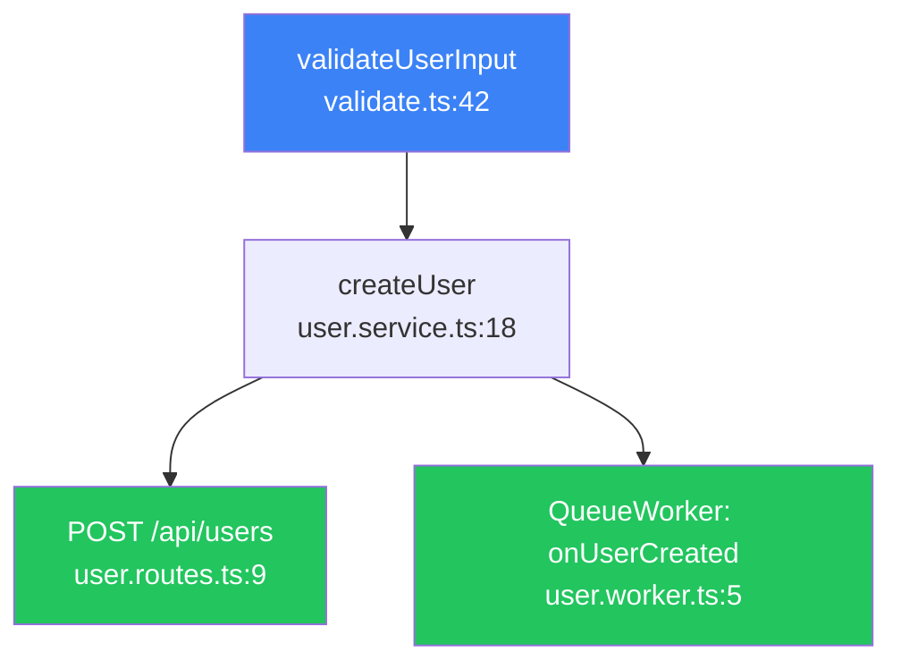

<p align="center">
  
</p>

# Mewra Pounce — Reverse Call Trace

> **See every route that can reach your function — at a glance.**

Mewra Pounce is an open-source VS Code extension that walks the reverse call hierarchy of any function and renders an interactive directed graph, highlighting every API route, background worker, and cron job that can reach it.

Part of the [Mewra](https://mewra.app) ecosystem alongside `moondi` and `mewra-dock`.

---

## Why

VS Code's built-in Call Hierarchy is a text tree. You expand it level by level to understand the full blast radius of a change. For deeply nested service code this takes minutes.

Mewra Pounce does the traversal for you and renders the result as a navigable graph — in seconds.

```
You place cursor on:  validateUserInput()

Mewra Pounce traces:  validateUserInput()
                       └── createUser()
                            ├── POST /api/users          ← Express route
                            └── QueueWorker: onUserCreated  ← BullMQ worker
```

---

## Features

- **One shortcut** — `Alt+T` on any function name opens the graph
- **Blast radius summary** — _⚠ Impacts 4 API Routes | 1 Background Worker_
- **Framework detection** — Express, Fastify, NestJS, Next.js App Router, Next.js Pages Router, BullMQ & Cron Workers
- **Interactive graph** — pan, zoom, click any node to jump to that line
- **Filter controls** — toggle test files (`Alt+Shift+T`) or filter to entry point routes only
- **Mermaid export** — one click to copy a Mermaid diagram ready for your PR
- **Local-first** — no AI, no network calls, no telemetry, zero cloud dependency

---

## Demo

| Action                   | Result                               |
| ------------------------ | ------------------------------------ |
| `Alt+T` on a function    | Graph opens beside the editor        |
| Click a node             | Jumps to that file and line          |
| `Alt+Shift+T`            | Toggles test files in the graph      |
| _Copy as Mermaid_ button | Copies Mermaid markdown to clipboard |

---

## Install

### From the VS Code Marketplace _(coming soon)_

Search `Mewra Pounce` in the Extensions panel or run:

```
ext install mewra.pounce
```

### From a release VSIX

1. Download `mewra-pounce-x.y.z.vsix` from [GitHub Releases](https://github.com/mewra/pounce/releases)
2. In VS Code: `Extensions → ··· → Install from VSIX…`

---

## Commands

| Command                        | Title                                    | Default keybinding |
| ------------------------------ | ---------------------------------------- | ------------------ |
| `mewra-pounce.trace`           | Mewra Pounce: Trace Callers              | `Alt+T`            |
| `mewra-pounce.toggleTestFiles` | Mewra Pounce: Toggle Test Files in Graph | `Alt+Shift+T`      |
| `mewra-pounce.exportMermaid`   | Mewra Pounce: Copy Graph as Mermaid      | _(webview button)_ |
| `mewra-pounce.clearCache`      | Mewra Pounce: Clear Entry Point Cache    | —                  |

---

## Settings

| Setting                              | Default  | Description                               |
| ------------------------------------ | -------- | ----------------------------------------- |
| `mewraPounce.maxDepth`               | `12`     | Maximum traversal depth                   |
| `mewraPounce.hideTestFilesByDefault` | `true`   | Hide test file nodes by default           |
| `mewraPounce.frameworks`             | all four | Frameworks to detect as entry points      |
| `mewraPounce.cacheEntryPoints`       | `true`   | Cache detected entry points per workspace |

---

## Supported frameworks (v1)

| Framework                | What is detected                                                              |
| ------------------------ | ----------------------------------------------------------------------------- |
| **Express**              | `app.get/post/put/patch/delete/use`, `router.*`                               |
| **Fastify**              | `fastify.get/post/route/register`                                             |
| **NestJS**               | Files ending in `.controller.ts` / `.resolver.ts` / `.gateway.ts`             |
| **Next.js App Router**   | `route.ts` files exporting `GET`/`POST`/…                                     |
| **Next.js Pages Router** | `pages/api/**/*.ts` exporting `default`                                       |
| **Workers & Cron Jobs**  | BullMQ, Inngest, Celery, `*.worker.*`, `*.cron.*`, `@Cron`                    |
| **FastAPI (Python)**     | `@app.get/post/...`, `@router.*`, `routers/`, `endpoints/`                    |
| **Flask (Python)**       | `@app.route`, `@bp.route`, blueprints, views                                  |
| **Django (Python)**      | `urls.py` patterns, `views.py` `View` / `ViewSet` / `APIView`                 |
| **Gin (Go)**             | `router.GET/POST/...`, `group.*`, handlers with `*gin.Context`                |
| **Echo (Go)**            | `e.GET/POST/...`, `g.*`, handlers with `echo.Context`                         |
| **Chi (Go)**             | `r.Get/Post/...`, `r.Route`, `r.Mount`                                        |
| **Standard net/http**    | `http.HandleFunc`, `http.Handle`, `ServeHTTP`                                 |
| **Plain Python / CLI**   | `main.py`, `cli.py`, `def main()`, `@click`, `typer`                          |
| **Plain Go**             | `main.go`, `func main()`                                                      |
| **Rust**                 | `main.rs`, `fn main()`, Actix-web, Axum, Rocket macros                        |
| **C / C++**              | `main.c/cpp`, `main()`, Embedded `app_main`, Crow, Drogon                     |
| **Java / Kotlin**        | Spring Boot `@*Mapping`, `@Scheduled`, `@KafkaListener`, `main`               |
| **C# (.NET)**            | ASP.NET Core `[Http*]`, Minimal API `app.Map*`, `Program.cs`                  |
| **PHP**                  | Laravel `Route::*`, Symfony `#[Route]`, `ShouldQueue`, `index.php`            |
| **Swift**                | Vapor `app.get/post`, SwiftUI `@main`, UIKit `viewDidLoad`, `@IBAction`       |
| **Flutter / Dart**       | `main.dart`, `runApp`, `build`, Shelf `router.*`, `@pragma('vm:entry-point')` |

---

## Mermaid export example



---

## Developing

See [CONTRIBUTING.md](./CONTRIBUTING.md) for the full guide.

**Quick start:**

```bash
git clone https://github.com/mewra-lab/mewra-pounce.git
cd mewra-pounce
pnpm install
pnpm build
```

Press `F5` in VS Code to launch the Extension Development Host.

**Quality gate:**

```bash
pnpm validate
```

Runs: format check → TypeScript check → unit tests → build.

---

## Stack

```
TypeScript · VS Code Extension API (Call Hierarchy LSP)
Preact · Cytoscape.js · ts-morph · Zod
esbuild · Vitest · Prettier · Husky + lint-staged
pnpm 12.3.4
```

---

## Roadmap

| Version          | Scope                                                                                         |
| ---------------- | --------------------------------------------------------------------------------------------- |
| **v1**           | TypeScript/JavaScript + Express/Fastify/NestJS/Next.js, Mermaid export, Cytoscape.js graph    |
| **v2 (current)** | Multi-language expansion: Python (FastAPI/Flask/Django/Celery) and Go (Gin/Echo/Chi/net/http) |
| **v2.1**         | Integration with Mewra core (`moondi` tracing/observability), smarter cache invalidation      |
| **v3**           | Cross-repo tracing for monorepos                                                              |

---

## Documentation

- [`SPEC.md`](./SPEC.md) — full product and technical specification
- [`docs/ARCHITECTURE.md`](./docs/ARCHITECTURE.md) — architecture, data flow, and trust boundaries
- [`docs/GIT-WORKFLOW.md`](./docs/GIT-WORKFLOW.md) — Git, branch, Conventional Commits & PR workflow
- [`docs/UX.md`](./docs/UX.md) — Webview UX, interaction patterns, and styling
- [`docs/TESTING.md`](./docs/TESTING.md) — unit and extension testing strategy
- [`docs/RELEASE.md`](./docs/RELEASE.md) — release and packaging guidelines
- [`CONTRIBUTING.md`](./CONTRIBUTING.md) — contributing guide and PR rules
- [`SECURITY.md`](./SECURITY.md) — security policy and threat model
- [`PRIVACY.md`](./PRIVACY.md) — local-first privacy statement

---

## Contributing

Contributions are welcome. Please read [CONTRIBUTING.md](./CONTRIBUTING.md) and [docs/GIT-WORKFLOW.md](./docs/GIT-WORKFLOW.md) before submitting a Pull Request.

## Security

Please report security issues privately. See [SECURITY.md](./SECURITY.md).

## Privacy

Mewra Pounce is 100% local. See [PRIVACY.md](./PRIVACY.md).

## License

[MIT](./LICENSE)
