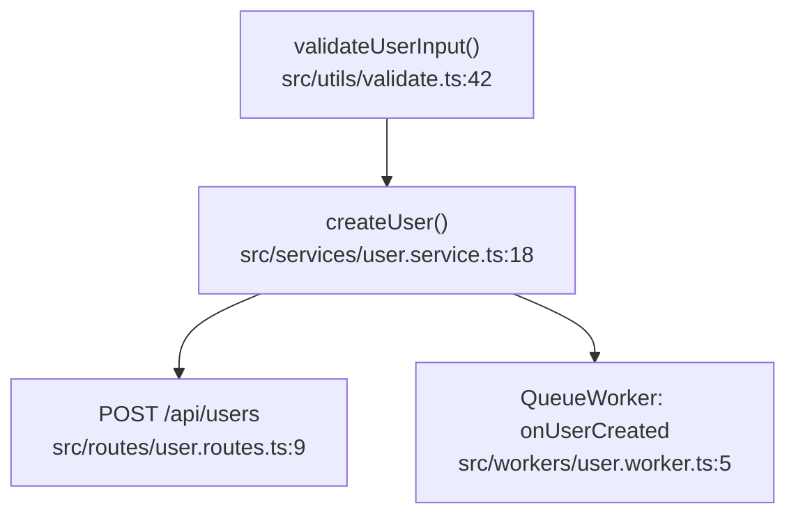

# Spec: Mewra Pounce — Reverse Call-Hierarchy Tracer

> Open-source reverse call hierarchy extension for VS Code — Part of the Mewra developer tooling ecosystem

---

## 0. Naming

| Item                                        | Chosen value                        | Notes                                                                                  |
| ------------------------------------------- | ----------------------------------- | -------------------------------------------------------------------------------------- |
| **Internal codename**                       | `pounce`                            | A cat "pouncing" on prey mirrors the idea of tracing back to the root cause            |
| **Product/Service name**                    | **Mewra Pounce**                    | Used in docs, landing page, marketing                                                  |
| **Extension display name (Marketplace)**    | `Mewra Pounce — Reverse Call Trace` | Shown in the VS Code Marketplace                                                       |
| **Extension identifier (`publisher.name`)** | `mewra.mewra-pounce`                | Uses the shared `mewra` publisher account for brand consistency with future extensions |
| **Repo**                                    | `github.com/mewra-lab/mewra-pounce` | Part of the Mewra developer tooling organization                                       |
| **Docs subdomain (future)**                 | `pounce.mewra.app`                  | Standalone landing/docs page                                                           |

`package.json`:

```json
{
  "name": "mewra-pounce",
  "displayName": "Mewra Pounce — Reverse Call Trace",
  "publisher": "mewra"
}
```

---

## 1. Executive Summary

| Dimension      | Detail                                                                                                                                                                                                                                   |
| -------------- | ---------------------------------------------------------------------------------------------------------------------------------------------------------------------------------------------------------------------------------------- |
| Problem solved | Developers edit deep logic in a service/helper without knowing which API routes it affects (unclear blast radius), and VS Code's native Call Hierarchy is a text tree you have to expand level by level — no big-picture view.           |
| Approach       | Use VS Code's built-in LSP Call Hierarchy API (no custom parser needed), do a reverse DFS over incoming calls until hitting a pattern that matches a framework entry point (route/controller/handler), then render an interactive graph. |
| Tech stack     | TypeScript, VS Code Extension API, `vscode.executePrepareCallHierarchyProvider` / `provideIncomingCalls`, Cytoscape.js (webview), AST fallback via `ts-morph` for pattern matching                                                       |
| Positioning    | 100% deterministic, no AI dependency, local-first, zero network calls in 0.1.0                                                                                                                                                           |
| Polyglot scope | Polyglot support across TS/JS, Python, Go, Rust, Java, C#, PHP, Swift, Dart with framework entry-point matching                                                                                                                          |

---

## 2. Goals / Non-Goals

### 2.1 Goals (0.1.0)

- Place the cursor on any function → hit a shortcut → see a graph of every path that leads to that function, traced all the way back to an entry point
- Auto-detect entry points for Express, Fastify, NestJS, Next.js, FastAPI, Flask, Django, Gin, Echo, Chi, Spring Boot, Laravel, ASP.NET Core, etc.
- Show a clear numeric Blast Radius summary (how many routes, how many workers)
- Export the graph as Mermaid markdown, ready to paste into a PR description
- Fast enough to traverse graphs with 1,000+ nodes in 2–3 seconds

### 2.2 Non-Goals (0.1.0)

- No cross-repo tracing in 0.1.0 (single workspace only; monorepo package tracing planned for 1.0.0)
- No resolution of dynamic/reflection-based dispatch (e.g. string-based DI lookups) — these are marked "unresolved" rather than guessed
- No AI integration in this architecture (may become an optional plugin later, not part of the core)

---

## 3. User Flow

```
1. User opens a .ts/.tsx file in VS Code
2. Places the cursor on a function name, e.g. `validateUserInput`
3. Presses Alt+T or right-clicks > "Mewra Pounce: Trace Callers"
4. Extension queries the LSP Call Hierarchy Provider for incoming calls
5. DFS walks upward, cutting cycles via a visited-set (Tarjan's algorithm for edge cases)
6. Each node is checked against the Entry Point Pattern Matcher
7. Once traversal finishes → a Webview Panel opens in the sidebar showing a directed graph
8. Header shows "⚠️ Impacts 4 API Routes | 1 Background Worker"
9. User can toggle "hide test files" or filter to public routes only
10. Clicking any node opens the file and jumps to that line
11. "Copy as Mermaid" copies markdown ready to paste into a PR
```

---

## 4. Architecture

```
┌─────────────────────────────┐
│   Extension Host (Node.js)   │
│                               │
│  ┌─────────────────────────┐ │
│  │ Trace Orchestrator       │ │◄── Command: mewra-pounce.trace
│  └───────────┬─────────────┘ │
│              │                │
│  ┌───────────▼─────────────┐ │
│  │ LSP Bridge                │ │  vscode.executePrepareCallHierarchyProvider
│  │                            │ │  vscode.provideIncomingCalls
│  └───────────┬─────────────┘ │
│              │                │
│  ┌───────────▼─────────────┐ │
│  │ Graph Builder              │ │  DFS + Tarjan's cycle detection
│  │ (in-memory DAG)             │ │
│  └───────────┬─────────────┘ │
│              │                │
│  ┌───────────▼─────────────┐ │
│  │ Entry Point Pattern       │ │  AST matcher (ts-morph)
│  │ Matcher                    │ │  per-framework adapter
│  └───────────┬─────────────┘ │
│              │                │
│  ┌───────────▼─────────────┐ │
│  │ Mermaid Exporter           │ │
│  └───────────┬─────────────┘ │
└──────────────┼────────────────┘
               │ postMessage (JSON graph payload)
┌──────────────▼────────────────┐
│   Webview (Sidebar Panel)      │
│   Cytoscape.js renderer        │
│   - Pan/zoom                    │
│   - Node click → openTextDocument│
│   - Filter controls              │
└─────────────────────────────────┘
```

---

## 5. Core Algorithm

### 5.1 Graph Traversal (Reverse BFS/DFS)

```typescript
interface CallNode {
  id: string; // `${filePath}:${symbolName}:${line}`
  symbolName: string;
  filePath: string;
  line: number;
  kind: vscode.SymbolKind;
  isEntryPoint: boolean;
  entryPointType?: "route" | "worker" | "cron" | "unknown";
  framework?: string;
}

interface CallEdge {
  from: string; // caller id
  to: string; // callee id
}

async function traceCallers(
  startItem: vscode.CallHierarchyItem,
  maxDepth = 12,
): Promise<{ nodes: CallNode[]; edges: CallEdge[] }> {
  const visited = new Set<string>(); // cycle detection (Tarjan-lite)
  const nodes: CallNode[] = [];
  const edges: CallEdge[] = [];

  async function dfs(item: vscode.CallHierarchyItem, depth: number) {
    const nodeId = toNodeId(item);
    if (visited.has(nodeId) || depth > maxDepth) return; // cut cycles + cap depth
    visited.add(nodeId);

    const isEntry = matchEntryPoint(item); // check pattern first
    nodes.push(toCallNode(item, isEntry));

    if (isEntry) return; // stop this branch once an entry point is found

    const incoming = await vscode.commands.executeCommand<
      vscode.CallHierarchyIncomingCall[]
    >("vscode.provideIncomingCalls", item);

    for (const call of incoming ?? []) {
      edges.push({ from: toNodeId(call.from), to: nodeId });
      await dfs(call.from, depth + 1);
    }
  }

  await dfs(startItem, 0);
  return { nodes, edges };
}
```

Note: cycle-cutting uses a simple `visited` set (sufficient for most DAG-like call graphs). Full Tarjan's SCC detection is reserved for a debug mode that explicitly reports "mutual recursion" separately from ordinary cycle-cutting.

### 5.2 Entry Point Pattern Matcher

Implemented as an adapter pattern per framework — new languages/frameworks can be added without touching the core:

```typescript
interface FrameworkAdapter {
  name: string;
  detect(node: ts.Node, sourceFile: ts.SourceFile): EntryPointMatch | null;
}

interface EntryPointMatch {
  type: "route" | "worker" | "cron";
  method?: string; // GET, POST, etc.
  path?: string; // '/api/users/:id'
}
```

Adapters required for v1:

| Framework                | Detected pattern                                                                                         |
| ------------------------ | -------------------------------------------------------------------------------------------------------- |
| **Express**              | `app.get(`, `app.post(`, `router.use(` — checks whether the callback function matches the current node   |
| **Fastify**              | `fastify.get(`, `fastify.route({ method, handler })`                                                     |
| **NestJS**               | `@Controller()` decorator on the class + `@Get()/@Post()` on the method                                  |
| **Next.js App Router**   | A `route.ts` file exporting `GET`/`POST`/etc., or a `page.tsx` file with `'use server'` (Server Actions) |
| **Next.js Pages Router** | A file under `pages/api/*.ts` exporting `default`                                                        |

Detection walks the file structure + AST via `ts-morph`, with results cached per workspace (invalidated on file change) so parsing isn't repeated on every trace.

---

## 6. UX Specification

### 6.1 Webview Graph Panel

- Library: **Cytoscape.js** (lighter than D3 for interactive directed graphs, with a built-in `dagre` layout algorithm)
- Layout: vertical `dagre` (entry points at the top, the starting function at the bottom)
- Node styling:
  - 🟢 Green = entry point (route/worker)
  - 🔵 Blue = the trace's starting point (the function the user selected)
  - ⚪ Gray = intermediate function
  - 🔴 Red border = unresolved/dynamic call that couldn't be followed
- Header bar:
  - `⚠️ Impacts 4 API Routes | 1 Background Worker`
  - Toggle buttons: `Hide test files` / `Public routes only`
  - Button: `Copy as Mermaid`

### 6.2 Commands

| Command ID                     | Title                                    | Default keybinding      |
| ------------------------------ | ---------------------------------------- | ----------------------- |
| `mewra-pounce.trace`           | Mewra Pounce: Trace Callers              | `Alt+T`                 |
| `mewra-pounce.toggleTestFiles` | Mewra Pounce: Toggle Test Files in Graph | `Alt+Shift+T`           |
| `mewra-pounce.exportMermaid`   | Mewra Pounce: Copy Graph as Mermaid      | — (webview button only) |
| `mewra-pounce.clearCache`      | Mewra Pounce: Clear Entry Point Cache    | —                       |

### 6.3 Settings (`settings.json`)

```jsonc
{
  "mewraPounce.maxDepth": 12,
  "mewraPounce.hideTestFilesByDefault": true,
  "mewraPounce.frameworks": ["express", "fastify", "nestjs", "nextjs"],
  "mewraPounce.cacheEntryPoints": true,
}
```

---

## 7. Mermaid Export Format



Export logic: convert `CallNode[]`/`CallEdge[]` directly into Mermaid syntax via string templating — no external library needed.

---

## 8. Performance Considerations

- **Default depth limit = 12** to prevent stack overflow in projects with unusually deep call chains
- **Entry point cache** stored in `.vscode/.mewra-pounce-cache.json` (gitignored) — invalidated via a file watcher whenever route files change
- **Debounce** tracing if the user hits the shortcut repeatedly
- If a single branch exceeds 500 incoming-call nodes, show a warning letting the user choose to "continue tracing" or "cut at this node"

---

## 9. Roadmap

| Version   | Status      | Scope                                                                                                                                                            |
| --------- | ----------- | ---------------------------------------------------------------------------------------------------------------------------------------------------------------- |
| **0.1.0** | **Current** | Reverse call hierarchy engine via LSP, interactive Cytoscape.js directed graph, polyglot framework entry points (TS/JS, Python, Go, etc.), Mermaid export        |
| **0.2.0** | Planned     | Active file-watcher cache invalidation, keyboard-first graph navigation (pan/zoom/focus), filter nodes by entry-point type                                       |
| **0.3.0** | Planned     | Deep AST pattern matching for dynamic dispatch, export graph as SVG/PNG, Mewra PreFlight integration (surface blast radius & affected routes in pre-push checks) |
| **1.0.0** | Future      | Cross-package & monorepo workspace tracing, production-stable release                                                                                            |

---

## 10. Risks

| Risk                                                                                                                    | Impact                       | Mitigation                                                                                                            |
| ----------------------------------------------------------------------------------------------------------------------- | ---------------------------- | --------------------------------------------------------------------------------------------------------------------- |
| TypeScript's LSP Call Hierarchy doesn't return complete results in some cases (dynamic imports, higher-order functions) | Incomplete graph             | Mark the node as "unresolved" instead of silently dropping it, so the user is aware of the blind spot                 |
| Pattern matcher goes stale as frameworks release new versions (e.g. Next.js changing its routing structure)             | Missed entry-point detection | Keep each adapter in its own file for easy updates without touching the core; test against sample repos per framework |
| Poor performance on very large codebases                                                                                | Sluggish/hanging UX          | Depth limit, node-count warning, caching                                                                              |

---

## 11. Success Metrics (personal use — subjective)

- Actually replaces VS Code's native "Find All References" / "Call Hierarchy" for daily work
- Measurably reduces time spent tracing "where is this function called from" compared to before the extension existed
- Mermaid export gets used in a real PR description at least once a week
